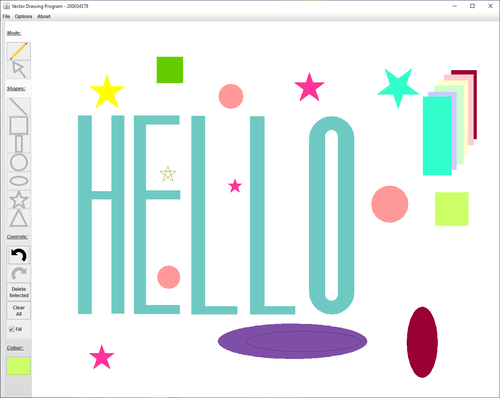

# Java Swing Vector Drawing

Welcome to this repository. This work was part of St Andrews' CS5001 coursework. Please feel free to download the .jar and play around with the drawing app. 
The app has a number of features including the ability to implement various different shapes in any given colour. Additionally, undo/redo functionality provides improved user experience. From the drawing window, .draw files can be saved or opened which is a lossless vector format which maintains shape positions, colours and sizes. In addition to this, .png files can be exported in the file menu.

An example of the program running can be seen below. 

This app has some room for improvement and so there are a small number of features which could be added to increase user experience. Some things which could be added may include:
 - Ability to edit the colours of existing shapes.
 - Ability to copy/paste or duplicate existing shapes
 - Ability to set a background colour

 ## Contact 
* Craig Myles (me@craig.im)